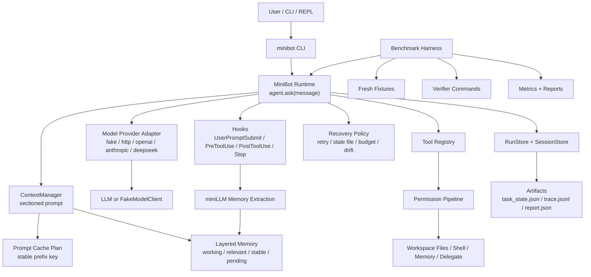

# MiniBot

<div align="center">

**一个轻量、本地优先、可审计、可评测的 Coding Agent 原型**

ReAct 工具调用 · 上下文管理 · 分层记忆 · 恢复机制 · Provider Adapter · Benchmark Harness · Interactive REPL

</div>

---

## MiniBot 是什么？

MiniBot 是一个面向本地代码仓库的 Coding Agent。它不是简单的 LLM API wrapper，而是围绕“让 Agent 能可靠地读代码、改文件、恢复失败、记录证据、接受评测”构建的一套小型工程系统。

它的核心目标是：

- 在本地仓库中执行可审计的 coding agent 工作流。
- 用结构化 prompt、工具协议、权限管线和 run artifacts 降低不可控行为。
- 用 memory、context compaction、recovery 和 hooks 观察多轮 agent 行为。
- 用 deterministic benchmark 和 real-model smoke test 证明系统机制，而不是只展示一次 demo。

MiniBot 当前适合作为学习和展示用的 Coding Agent 项目：足够小，能读懂；机制完整，能面试展开。

## 设计思想

MiniBot 的设计遵循几个原则：

| 原则 | 说明 |
| --- | --- |
| 本地优先 | 默认在当前 workspace 内运行，所有读写都经过 workspace 边界和权限检查。 |
| 正确性不依赖缓存或记忆 | prompt cache、memory、context retrieval 都是辅助优化；cache miss 或 memory miss 不应改变核心执行语义。 |
| 工具调用可审计 | 每轮运行都会写 `task_state.json`、`trace.jsonl`、`report.json`，便于复盘和评测。 |
| 上下文显式分层 | prompt 被拆成 identity、workspace、tools、task_state、memory、history、current_request 等 section。 |
| Provider 差异显式建模 | OpenAI、Anthropic、DeepSeek、generic HTTP 和 fake provider 的能力边界分开处理。 |
| 评测优先 | deterministic fake model 用来测试 harness、fixtures、verifier、failure taxonomy 和 metrics；real mode 只做显式 opt-in smoke。 |

## 架构图



## 主要亮点

### 1. ReAct 风格工具调用

模型通过明确协议调用工具：

```xml
<tool>{"name":"read_file","args":{"path":"README.md","start":1,"end":40}}</tool>
<final>answer</final>
```

支持批量工具调用，并对参数 schema、workspace path、risk level 做校验。

### 2. 权限与安全边界

MiniBot 内置 `approval` 策略：

- `ask`: 风险操作需要确认。
- `auto`: 自动允许。
- `deny_risky`: 拒绝风险工具。
- `never`: 兼容旧策略，拒绝需要确认的操作。

所有文件路径都会被限制在 workspace 内，避免 path escape。

### 3. 上下文管理与压缩

Prompt 被拆成稳定 section 和动态 section。当前请求始终被保护，不会被压缩掉。

动态 transcript、tool observation 和 history 会在预算不足时进行确定性压缩，并把压缩原因写入 metadata。

### 4. 分层记忆系统

MiniBot 有 working memory、relevant memory、stable project memory 和 pending memory。Stop hook 会触发 memory extraction，但只进入 pending，不会自动写入稳定 `MEMORY.md`。

miniLLM memory extraction 失败时非阻断，会 fallback，不影响 final answer 和 stop reason。

### 5. Provider Adapter

支持：

- `fake`: deterministic fake model，适合测试。
- `http`: generic HTTP provider。
- `openai`
- `anthropic`
- `deepseek`

Provider 层会处理 OpenAI / Anthropic wire format、DeepSeek base URL 差异、response shape、usage metadata、provider error taxonomy。

### 6. Provider-aware Prompt Cache Key

MiniBot 只对稳定前缀生成 cache key：

- `identity`
- `workspace`
- `tools`
- `memory_index`

不把下面这些动态内容放进 key：

- `current_request`
- `history`
- `tool observation`
- `task_state`
- `working_memory`
- `relevant_memory`

OpenAI-capable provider 才会发送 `prompt_cache_key` 和 `prompt_cache_retention`。Anthropic block-level `cache_control` 没有被伪装成 OpenAI 参数。

### 7. 可复现 Benchmark 与报告

MiniBot 有固定 benchmark harness，使用 deterministic fake model 测试核心机制：

- documentation
- text-edit
- code-modification
- tool-boundary
- context
- memory
- recovery
- delegate/hooks

每个任务都有 fresh fixture、scripted model outputs、step budget、expected artifact、verifier command 和 category。

### 8. Interactive REPL

`minibot repl` 可以连续输入多轮消息，在同一个进程中复用同一个 session，便于观察 history、memory、prompt cache key 和 artifacts。

## Quick Start

### 1. 准备环境

要求 Python 3.10+。

```powershell
cd D:\CodingAgentProject\MiniBot
```

开发模式有两种方式。

方式 A：临时设置 `PYTHONPATH`：

```powershell
$env:PYTHONPATH="src"
python -m minibot --help
```

方式 B：安装为 editable package：

```powershell
python -m pip install -e .
minibot --help
```

下面命令默认使用方式 A。

### 2. 跑一个 fake smoke

```powershell
$env:PYTHONPATH="src"
python -m minibot --cwd . --approval auto --model-provider fake --fake-response "<final>MiniBot fake smoke ok.</final>" "hello"
```

### 3. 跑一个工具调用 smoke

```powershell
$env:PYTHONPATH="src"
python -m minibot --cwd . --approval auto --model-provider fake --fake-response '<tool>{"name":"list_files","args":{"path":"."}}</tool>' "List repo files."
```

运行后可以查看：

```powershell
Get-ChildItem .minibot\runs -Recurse
```

### 4. 使用 REPL

```powershell
$env:PYTHONPATH="src"
python -m minibot repl --cwd . --approval auto --model-provider fake
```

REPL 内支持：

```text
/help
/session
/reset
/exit
```

### 5. 配置真实 LLM

复制 `.env.example` 为 `.env`，填入自己的 API key。`.env` 已被 git ignore，不要提交。

DeepSeek OpenAI-compatible 示例：

```env
MINIBOT_MODEL_PROVIDER=http
MINIBOT_API_FORMAT=openai
MINIBOT_MODEL_NAME=deepseek-v4-pro
MINIBOT_BASE_URL=https://api.deepseek.com
MINIBOT_API_KEY=replace-with-your-api-key
```

DeepSeek Anthropic-compatible 示例：

```env
MINIBOT_MODEL_PROVIDER=http
MINIBOT_API_FORMAT=anthropic
MINIBOT_MODEL_NAME=deepseek-v4-pro
MINIBOT_BASE_URL=https://api.deepseek.com/anthropic
MINIBOT_API_KEY=replace-with-your-api-key
```

真实模型单轮 smoke：

```powershell
$env:PYTHONPATH="src"
python -m minibot --cwd . --approval auto "Read README.md and summarize this project in one paragraph."
```

## Benchmark 与评测方法

MiniBot 的 benchmark 分两类：

| 模式 | 命令 | 目的 |
| --- | --- | --- |
| Mock benchmark | `python -m minibot benchmark` | 用 deterministic fake model 验证 harness、fixtures、verifier、tool boundary、memory、recovery、metrics。 |
| Real benchmark | `python -m minibot benchmark --real` | 显式 opt-in，用真实模型做小规模 smoke，验证 provider 接线和真实模型能否驱动工具协议。 |

### 1. 跑 deterministic benchmark

```powershell
$env:PYTHONPATH="src"
python -m minibot benchmark --artifact-path artifacts/harness-regression-v2.json
```

当前 deterministic benchmark 目标是 12 个 MVP 任务。一次通过时会看到类似：

```json
{
  "passed": 12,
  "total_tasks": 12,
  "pass_rate": 1.0,
  "verifier_pass_rate": 1.0,
  "within_budget_rate": 1.0
}
```

### 2. 生成核心报告

```powershell
$env:PYTHONPATH="src"
python -m minibot metrics --harness-artifact-path artifacts/harness-regression-v2.json --report-path artifacts/minibot-benchmark-core-report.md
```

查看报告：

```powershell
Get-Content artifacts/minibot-benchmark-core-report.md -Encoding UTF8
```

核心报告会汇总：

- pass rate
- verifier pass rate
- within-budget rate
- median tool steps
- category pass rates
- failure category counts
- failure examples
- tool-boundary/security evidence

### 3. 跑真实模型 benchmark smoke

真实模式建议先限制任务数，避免成本失控：

```powershell
$env:PYTHONPATH="src"
python -m minibot benchmark --real --max-tasks 1 --artifact-path artifacts/harness-real-v1.json
```

查看结果：

```powershell
$json = Get-Content artifacts/harness-real-v1.json -Encoding UTF8 | ConvertFrom-Json
$json.summary
$json.rows[0] | Select-Object id, category, passed, stop_reason, failure_category, tool_steps
$json.rows[0].model_metadata | ConvertTo-Json -Depth 8
```

### 4. 生成 methodology report

```powershell
$env:PYTHONPATH="src"
python -m minibot metrics --methodology-report --harness-artifact-path artifacts/harness-regression-v2.json --real-harness-artifact-path artifacts/harness-real-v1.json --report-path artifacts/minibot-benchmark-methodology-report.md
```

查看：

```powershell
Get-Content artifacts/minibot-benchmark-methodology-report.md -Encoding UTF8
```

Methodology report 会把 mock 和 real artifact 分开解释，避免把单次 real run 过度声称为泛化能力。

## 如何查看一次 Agent 运行的证据链

每次 `agent.ask(...)` 都会生成 run artifact：

```text
.minibot/
  sessions/
    <session_id>.json
  runs/
    <run_id>/
      task_state.json
      trace.jsonl
      report.json
```

常用查看命令：

```powershell
$run = Get-ChildItem .minibot\runs | Sort-Object LastWriteTime -Descending | Select-Object -First 1
Get-Content $run.FullName\task_state.json -Encoding UTF8
Get-Content $run.FullName\report.json -Encoding UTF8
Get-Content $run.FullName\trace.jsonl -Encoding UTF8
```

重点看：

- `task_state.json`: run id、status、stop reason、tool steps、attempts。
- `trace.jsonl`: prompt build、model requested、tool executed、hook emitted、recovery triggered。
- `report.json`: prompt metadata、provider metadata、hook summary、memory summary、recovery summary。

## 测试

跑核心测试：

```powershell
python -m unittest tests.test_context_manager -v
python -m unittest tests.test_model_providers -v
python -m unittest tests.test_runtime -v
python -m unittest tests.test_repl -v
python -m unittest tests.test_prompt_cache -v
```

跑全量测试：

```powershell
python -m unittest discover -s tests -v
python -m compileall -q src tests
git diff --check
```

最近一次全量验证结果：

```text
132 tests OK
deterministic benchmark: 12 / 12 passed
```

## 项目结构

```text
src/minibot/
  cli.py              # CLI / benchmark / metrics / repl entry
  runtime.py          # MiniBot runtime and agent.ask loop
  context_manager.py  # sectioned prompt, context compaction, metadata
  tools.py            # tool registry, schemas, dispatch
  permission.py       # approval policy and workspace safety
  memory.py           # layered memory state and store
  memory_llm.py       # miniLLM memory extraction subchain
  hooks.py            # lifecycle hooks
  recovery.py         # recovery policy and observations
  delegate.py         # bounded child-agent delegation
  model_providers.py  # fake/http/openai/anthropic/deepseek provider adapter
  prompt_cache.py     # stable prefix prompt cache key planning
  evaluator.py        # fixed benchmark harness
  metrics.py          # report and methodology metrics
  repl.py             # interactive REPL

benchmarks/
  coding_tasks.json   # deterministic benchmark task suite
  fixtures/           # fresh fixture repos

tests/
  test_*.py           # unit and regression tests
```

## 简历表述建议

可以安全写：

> 设计并实现一个本地 Coding Agent 原型 MiniBot，包含 ReAct 工具调用、权限管线、上下文压缩、分层记忆、miniLLM memory extraction、provider adapter、交互式 REPL 和固定 benchmark harness；构建可复现评测流程，使用 deterministic fake model 覆盖 12 个核心机制任务，并生成 metrics/methodology report 分析 pass rate、failure taxonomy、tool steps 和 provider error。

不要过度声称：

- 不要说 MiniBot 达到了 SWE-bench / GAIA / WebArena 的同级别能力。
- 不要用一次 real-model run 代表模型泛化能力。
- 不要说 memory 已经解决长期个性化，只能说有 pending memory 和可审计 extraction 机制。
- 不要说 prompt cache 一定降低成本；当前只是 provider-aware key 和 usage 记录，真实收益依赖 provider。

## License

本项目使用仓库中的 `LICENSE` 文件声明的许可证。
